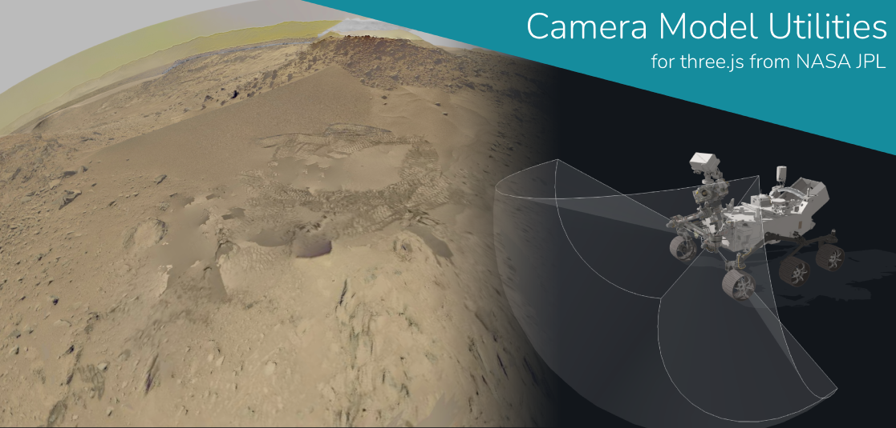

# CameraModelUtilsJS

Series of packages for visualizing and rendering images and frustum shapes based on CAHVORE camera models as well as loading SGI, PGM, PDS, and Vicar images in three.js.

## Examples

[Rendering CAHVORE Frustums](https://nasa-ammos.github.io/CameraModelUtilsJS/examples/frustumDisplay.html)

[Rendering Camera View with Distortion](https://nasa-ammos.github.io/CameraModelUtilsJS/examples/distortionPreview.html)

[Vicar Loading](https://nasa-ammos.github.io/CameraModelUtilsJS/examples/vicarLoader.html)

[PDS Loading](https://nasa-ammos.github.io/CameraModelUtilsJS/examples/pdsLoader.html)

[RGB Loading](https://nasa-ammos.github.io/CameraModelUtilsJS/examples/rgbLoader.html)

[PGM Loading](https://nasa-ammos.github.io/CameraModelUtilsJS/examples/pgmLoader.html)

## Package Docs

[CAHVORE Functions and Distortion Shader](./src/cahvore-utilities/)

Three.js Javascript port of functions for retreiving distorted CAHVORE rays, calculating three.js frames and frustums, and rendering CAHVORE-distorted rendered images.

[Frustum Meshes](./src/frustum-mesh/)

Three.js utilitiies to for generating and visualizing linear and CAHVORE frustum geometry.

[SGI Loader](./src/sgi-loader/)

Utility for loading Silicon Graphics image format files into a three.js data texture.

[PGM Loader](./src/pgm-loader/)

Utility for loading PGM image format files into a three.js data texture.

[Vicar Loader](./src/vicar-loader/)

Utility for loading Vicar image format files into a three.js data texture.

[PDS Loader](./src/pds-loader/)

Utility for loading PDS image format files into a three.js data texture.

# LICENSE

The software is available under the [Apache V2.0 license](../LICENSE.txt).

Copyright © 2022 California Institute of Technology. ALL RIGHTS
RESERVED. United States Government Sponsorship Acknowledged.
Neither the name of Caltech nor its operating division, the
Jet Propulsion Laboratory, nor the names of its contributors may be
used to endorse or promote products derived from this software
without specific prior written permission.
